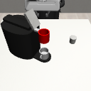
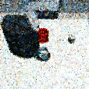
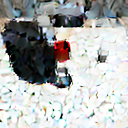

# Stem-OB: Generalizable Visual Imitation Learning with Stem-Like Convergent Observation through Diffusion Inversion


Visual imitation learning methods demonstrate strong performance, yet they lack generalization when faced with visual input perturbations like variations in lighting and textures. This limitation hampers their practical application in real-world settings. To address this, we propose Stem-OB that leverages the inversion process of pretrained image diffusion models to suppress low-level visual differences while maintaining high-level scene structures. This image inversion process is akin to transforming the observation into a shared representation, from which other observations also stem. Stem-OB offers a simple yet effective plug-and-play solution that stands in contrast to data augmentation approaches. It demonstrates robustness to various unspecified appearance changes without the need for additional training. We provide theoretical insights and empirical results that validate the efficacy of our approach in simulated and real settings. Stem-OB show an exceptionally significant improvement in real-world robotic tasks, where challenging light and appearance changes are present, with an average increase of 22.2% in success rates compared to the best baseline.

## Installation
Installation is extremely simple, you only need to run a few pip installs.

```bash
conda create -n myenv python=3.9 -y
conda activate myenv
pip install -r requirements.txt
```

## Usage

```bash
python invert.py --img_path figures/test.png --output_path figures/output.png --model ddpm # use DDPM
python invert.py --img_path figures/test.png --output_path figures/output.png --model ddim # use DDIM
python invert.py --img_path figures/test.png --output_path figures/output.png --model ddpm --num_steps 50 --inversion_steps 15 # use DDPM with 50 steps and 15 inversion steps
```
You can try DDPM and DDIM models with the above commands. You can also change the number of steps and inversion steps, as long as the number of inversion steps is less than or equal to the number of steps.

## Sample Output

<div style="display: flex; justify-content: space-around;">
    
    
    
</div>

The left image is the original image, the middle image is the inverted image using DDPM, and the right image is the inverted image using DDIM.
